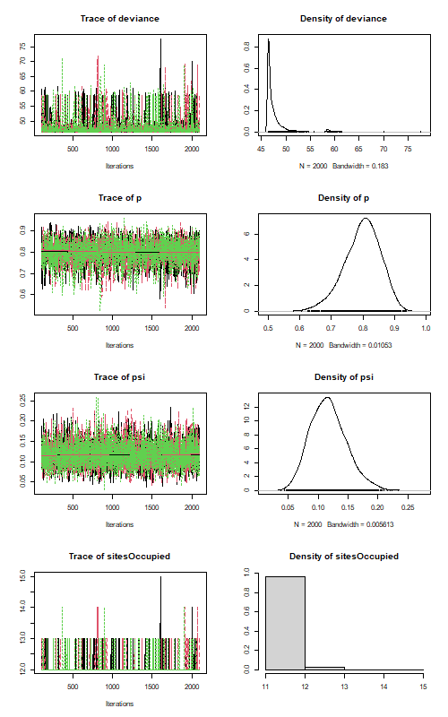

```{r setup, include=FALSE}
library(formatR)
knitr::opts_chunk$set(
  #tidy = TRUE,
  #tidy.opts = list(width.cutoff = 60),
  echo = TRUE)
```

### Asignment

Create a self-contained R script or Rmarkdown file to do the following:

1. Import the Canada Warbler data (`cawa_data_2017_occu.csv`) and compute basic summary stats like we did earlier.

* Data are “point count data” from North Carolina. 
* Each 10-min survey was divided into 4, 2.5-min intervals

```{r Data Import and Summary}
# data import and column rename
setwd("C:/Users/henry/Desktop/WILD8390/Homework/HW02")
warbler_df <- read.csv("cawa_data_2017_occu.csv")
colnames(warbler_df) <- c("Site", "obs1", "obs2", "obs3", "obs4")

# background values
nSites <- length(warbler_df[,1])
nVisits <- 4

# number of detections for each site
siteDets <- rowSums(warbler_df[,2:5])
table(siteDets)

# naive occupancy (proportion of sites with >0 observations)
naiveOccupancy <- sum(siteDets>0)/nSites
naiveOccupancy
```

2. Fit the single-season (static) occupancy model using `unmarked` and `JAGS`.

```{r Model fitting: unmarked}
library(unmarked)

# convert to 'unmarkedFrame' data structure
# remove site names for summary to be cleaner
umf <- unmarkedFrameOccu(y=warbler_df[,2:5])
summary(umf)

# model fitting
fm <- occu(~1 ~1, umf)
summary(fm)

backTransform(fm, type="state")
backTransform(fm, type="det")

# posterior probs Pr(z_1 | y_i)
z.post <- ranef(fm)
# extract posterior means
psi_realized <- bup(z.post, stat="mean")

round(data.frame(y=warbler_df[,2:5], psi_expected=predict(fm, type="state")[,1], psi_realized), 3)

nsim <- 1000
sites.occupied.post <- predict(z.post, func=sum, nsim=nsim)
par(mai=c(0.9,0.9,0.1,0.1))
plot(table(sites.occupied.post)/nsim, lwd=5, xlab="Sites occupied",
    ylab="Empirical Bayes posterior probability")

psi.realized.estimate <- median(sites.occupied.post)
psi.realized.estimate

quantile(sites.occupied.post, prob=c(0.025, 0.975))
```
```{r Model fitting: JAGS, fig.width=5, fig.height=5}
library(jagsUI)
library(rjags)

string <- "
model {
  psi ~ dunif(0,1)
  p ~ dunif(0,1)
  
  for(i in 1:nSites) {
    z[1] ~ dbern(psi)
    for(j in 1:nVisits) {
      y[i,j] ~ dbern(z[i]*p)
    }
  }
  
  sitesOccupied <- sum(z)
}
"

jags.data <- list(y=warbler_df[,2:5],
                  nSites = nSites,
                  nOccasions=nVisits)
jags.inits <- function() {
  list(psi=runif(1), p = runif(1), z=rep(1,nSites))
}
jags.pars <- c("psi", "p", "sitesOccupied")

jags.post.samples <- jags.basic(data=jags.data, inits=jags.inits,
                                parameters.to.save=jags.pars,
                                model.file="occupancy-model.jag",
                                n.chains=3, n.adapt=100, n.burnin=0,
                                n.iter=2000, parallel=TRUE)

summary(jags.post.samples)

# run this before if having issues:
# while (!is.null(dev.list())) dev.off()
# run all 3 lines selected together
png("jags_plot.png", width = 500, height = 800)
plot(jags.post.samples)
dev.off()

```



3. Create a data.frame to compare the estimates of $\psi$, $p$, and `nSitesOccupied` from the two analyses. Compare point estimates and 95% CIs. Describe any differences you see in the estimates.

```{r Comparison}
# I had to do some messing around here to get things to pull dynamically
# this is the way that made the most sense to me since jags.post.samples is an unnamed list
library(coda)

# parms for df rows
parameters <- c("psi", "p", "sitesOccupied")

# backtransform estimates
unmarked_psi <- backTransform(fm, type = "state")@estimate
unmarked_p <- backTransform(fm, type = "det")@estimate

# pulls CIs from fitted model
psi_CI <- confint(fm, type = "state")
p_CI <- confint(fm, type = "det")

#back to probability scale from logit scale
unmarked_psi_CI <- plogis(psi_CI)
unmarked_p_CI <- plogis(p_CI)

unmarked_sites <- median(sites.occupied.post)
unmarked_sites_CI <- quantile(sites.occupied.post, c(0.025, 0.975))

# JAGS output was giving me an unnamed list so i had to pull this out weird
# now we can combine all samples in one matrix for everything
jags_mcmc <- as.mcmc.list(jags.post.samples)
jags_samples <- as.matrix(jags_mcmc)

jags_estimates <- sapply(parameters, function(x) {
  mean(jags_samples[, x])
})

jags_CIs <- t(sapply(parameters, function(x) {
  quantile(jags_samples[, x], c(0.025, 0.975))
}))

# now through all that in a dataframe
df_compare <- data.frame(
  Parameter = parameters,
  unmarked_Estimate = c(
    unmarked_psi,
    unmarked_p,
    unmarked_sites
  ),
  unmarked_Lower = c(
    unmarked_psi_CI[1],
    unmarked_p_CI[1],
    unmarked_sites_CI[1]
  ),
  unmarked_Upper = c(
    unmarked_psi_CI[2],
    unmarked_p_CI[2],
    unmarked_sites_CI[2]
  ),
  JAGS_Estimate = jags_estimates,
  JAGS_Lower = jags_CIs[, 1],
  JAGS_Upper = jags_CIs[, 2]
)

# round for presentation
library(dplyr)

table_compare <- df_compare %>%
  mutate(
    unmarked = sprintf(
      "%.3f (%.3f–%.3f)",
      unmarked_Estimate,
      unmarked_Lower,
      unmarked_Upper
    ),
    JAGS = sprintf(
      "%.3f (%.3f–%.3f)",
      JAGS_Estimate,
      JAGS_Lower,
      JAGS_Upper
    )
  ) %>%
  select(Parameter, unmarked, JAGS)

knitr::kable(
  table_compare,
  caption = "Comparison of models",
  col.names = c("Parameter", "unmarked", "JAGS"),
  align = c("l", "c", "c")
)
```
The estimates from `unmarked` and JAGS analysis were nearly identical. Occupancy ($\psi$) estimates were within one hundredth of each other, and CIs overlapped. Detection probabilities were also quite similar. The differences in CIs for the number of sites occupied come from maximum likelihood versus Bayesian estimation. The `unmarked` analysis had a median estimate of 12 occupied sites with a 95% interval of [12, 12], while the JAGS analysis had a posterior mean of 12.04 sites with a 95% credible interval of 12–13. Thus, both methods support 12 occupied sites, although JAGS assigns a small probability to 13 occupied sites.


